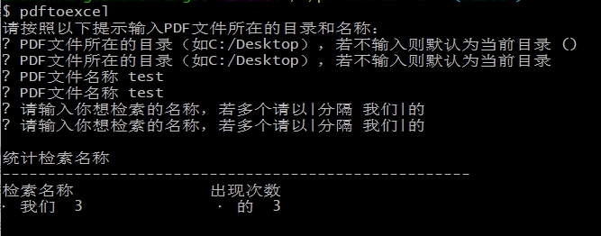

# PDFTOEXCEL
A light tool to read the words in PDF, then export them into the excel and display them in the terminal

# Installation
```
npm install pdftoexcel-cli -g
```
or
```
git clone https://github.com/zwf193071/pdftoexcel-cli.git

cd pdftoexcel-cli && npm install

npm link
```

# Usage



# License
MIT.


